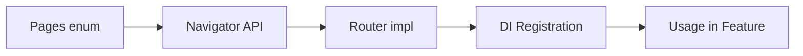
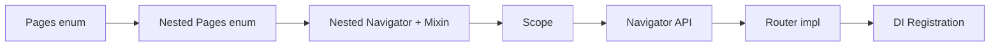

# Навигация в проекте

## 🎯 Цель документа

Трёхуровневая декларативная навигация: Global → Feature → Nested

---

## 📐 Архитектура

**Level 1: Global Navigator**

- Управление основным стеком страниц
- Navigation Guards
- Декларативный API

**Level 2: Feature Pages**

- Enum-based типизированные маршруты
- Фабричные методы создания экранов
- Поддержка аргументов

**Level 3: Nested Navigator**

- Изолированные multi-step флоу
- Переиспользуемая логика (mixin)
- Локальный стек страниц

---

## Level 1: Global Navigator

### API методы

```dart
class AppNavigator {
  // Основные
  static void push(context, page);      // Добавить страницу
  static void pop(context);             // Убрать последнюю
  static void reset(context, newHome);  // Сбросить стек

  // Декларативная модификация
  static void change(context, (pages) => newPages);

  // Специальные
  static void removePages(context, ['page1', 'page2']);
  static void popToPage(context, 'targetPage');
  static void pushStack(context, [page1, page2]);
}
```

### Декларативное управление

**Правило:** Используй `change()` для сложной модификации стека

**Пример:**

```dart
// ❌ Императивный
Navigator.of(context).push(MaterialPageRoute(...));

// ✅ Декларативный
AppNavigator.push(context, Pages.profile.page());

// ✅ Сложная модификация
AppNavigator.change(context, (pages) {
  return pages.where((p) => !isAuthPage(p)).toList()
    ..add(Pages.home.page());
});
```

---

### Navigation Guards

**Правило:** Используй Guards для автоматической защиты маршрутов

**Структура:**

```dart
// 1. Интерфейс
abstract class NavigationGuard {
  bool shouldApply(context, page);
  List<Page> apply(context, currentPages, newPage);
}

// 2. Пример: очистка auth-страниц после входа
class AfterLoginGuard implements NavigationGuard {
  bool shouldApply(context, page) => isProtectedPage(page);

  List<Page> apply(context, pages, newPage) {
    if (!isAuthenticated(context)) return [...pages, newPage];

    // Убираем auth-страницы из стека
    return pages.where((p) => !isAuthPage(p)).toList()
      ..add(newPage);
  }
}

// 3. Регистрация
final guardManager = NavigationGuardManager(
  navigationGuard: [AfterLoginGuard(), LogoutGuard()],
);
```

---

## Level 2: Feature Pages

### Enum-based роутинг

**Правило:** Типизированные маршруты через enum

**Структура:**

```dart
enum Pages {
  home('home'),
  auth('auth'),
  profile('profile'),
  detail('detail');

  const Pages(this.name);
  final String name;

  // Factory метод
  Page page({Map<String, String>? args}) => MaterialPage(
    key: ValueKey(args == null ? this : args.values.first),
    name: '/$name',
    child: Builder(builder: (ctx) => builder(ctx, args)),
  );

  // Создание экранов
  Widget builder(BuildContext ctx, Map<String, String>? args) {
    return switch (this) {
      home => HomePage(),
      auth => AuthPage(),
      profile => ProfileWizardNavigator(),  // ✅ Nested Navigator
      detail => DetailPage(id: args?['id'] ?? ''),
    };
  }
}
```

### Передача аргументов

**Пример:**

```dart
// Push с аргументами
AppNavigator.push(
  context,
  Pages.detail.page(arguments: {'id': '123'}),
);

// Извлечение в builder
detail => DetailPage(id: args?['id'] ?? ''),
```

---

## Level 3: Nested Navigator

### Когда использовать

| ✅ Используй                              | ❌ Не используй     |
| ----------------------------------------- | ------------------- |
| Multi-step flows (wizard, onboarding)     | Одностраничные фичи |
| Изолированная навигация внутри фичи       | Модальные диалоги   |
| Независимый стек (можно сбросить целиком) | Bottom sheets       |

---

### Структура (3 компонента)

**1. Nested Pages Enum**

```dart
enum WizardPages {
  step1, step2, step3;

  Page page({Map<String, String>? args}) => MaterialPage(
    key: ValueKey('nested_$name'),  // ✅ Префикс nested_
    name: '/wizard/$name',          // ✅ Вложенный маршрут
    child: Builder(builder: (ctx) => builder(ctx, args)),
  );

  Widget builder(ctx, args) => switch (this) {
    step1 => Step1Page(),
    step2 => Step2Page(data: args?['data']),
    step3 => Step3Page(),
  };
}
```

**2. Nested Navigator Widget**

```dart
class WizardNavigator extends StatefulWidget {
  const WizardNavigator({this.initialPage, super.key});
  final WizardPages? initialPage;

  // Статические методы
  static void pushPage(ctx, WizardPages page, {args});
  static bool pop(ctx);
  static void reset(ctx, WizardPages page);

  @override
  State createState() => _WizardNavigatorState();
}
```

**3. Navigator State + Mixin**

```dart
class _WizardNavigatorState extends State<WizardNavigator>
    with NavigationControllerMixin<WizardNavigator> {

  @override
  Page get homePage => WizardPages.step1.page();

  @override
  void initState() {
    super.initState();
    initializeController([
      (widget.initialPage ?? WizardPages.step1).page()
    ]);
  }

  @override
  void dispose() {
    disposeController();
    super.dispose();
  }

  @override
  Widget build(ctx) => WizardScope(
    child: buildNavigator(restorationScopeId: 'wizard_nav'),
  );
}
```

---

### NavigationControllerMixin

**Возможности:**

```dart
mixin NavigationControllerMixin<T> on State<T> {
  // Lifecycle
  void initializeController(initialPages);
  void disposeController();
  void onPagesChanged();  // Hook для отладки

  // Навигация
  void change((pages) => newPages);
  void removePagesByNames(['page1', 'page2']);
  void popToPageByName('targetPage');

  // Утилиты
  List<Page> get currentPages;
  String? extractPageName(page);
  Widget buildNavigator({observers, restorationScopeId});
}
```

---

## Navigator API Pattern

**Правило:** Абстрагируй навигацию через интерфейсы (Dependency Inversion)

### Полный цикл

```dart
// 1️⃣ Interface (core/navigator_api)
abstract interface class FeatureNavigator {
  void goToScreen(BuildContext context);
  void goToDetail(BuildContext context, {required String id});
  void goBack(BuildContext context);
}

// 2️⃣ Implementation (app/navigation/navigators)
class FeatureNavigatorImpl implements FeatureNavigator {
  @override
  void goToScreen(context) =>
    AppNavigator.push(context, Pages.feature.page());

  @override
  void goToDetail(context, {required id}) =>
    AppNavigator.push(context, Pages.detail.page(arguments: {'id': id}));

  @override
  void goBack(context) => AppNavigator.pop(context);
}

// 3️⃣ DI Registration (composition_root.dart)
final featureNavigator = FeatureNavigatorImpl();
final dependencies = FeatureDependencies(navigator: featureNavigator);

// 4️⃣ Usage (feature/widget)
class FeatureScreen extends StatelessWidget {
  Widget build(context) {
    final nav = FeatureDependencies.of(context).navigator;

    return ElevatedButton(
      onPressed: () => nav.goToDetail(context, id: '123'),
      child: Text('Open Detail'),
    );
  }
}
```

**Преимущества:**

- ✅ Фича не зависит от реализации навигации
- ✅ Легко мокировать для тестов
- ✅ Можно заменить навигационный фреймворк

---

## 🎨 Strategy Pattern

**Применение:** Переиспользование экрана с разным поведением навигации

```dart
// 1️⃣ Интерфейс стратегии
abstract interface class NavigationStrategy {
  void onComplete(BuildContext context, {required String data});
}

// 2️⃣ Конкретные стратегии
class FlowAStrategy implements NavigationStrategy {
  void onComplete(context, {required data}) =>
    navigator.goToScreenA(context, data: data);
}

class FlowBStrategy implements NavigationStrategy {
  void onComplete(context, {required data}) =>
    navigator.goToScreenB(context, data: data);
}

// 3️⃣ Использование
SharedScreen(
  strategy: FlowAStrategy(),  // ✅ Выбор стратегии
  onComplete: (data) => strategy.onComplete(context, data: data),
);
```

**Преимущества:** DRY + Open-Closed + Явное управление поведением

---

## Best Practices

### Обработка Back в Nested Navigator

```dart
@override
bool handlePopPage(route, result) {
  if (!route.didPop(result)) return false;

  // Если последняя страница → выход из nested
  if (currentPages.length <= 1) {
    AppNavigator.pop(context);
    return false;
  }

  // Иначе просто убираем страницу
  change((pages) => pages.sublist(0, pages.length - 1));
  return true;
}
```

---

## Чеклисты

### Simple Feature



**Шаги:**

1. Добавь маршрут в `Pages` enum
2. Создай интерфейс в `core/navigator_api/feature_navigator.dart`
3. Реализуй Router в `app/navigation/navigators/feature_navigator.dart`
4. Зарегистрируй в `composition_root.dart` и DI Container
5. Используй в фиче: `Dependencies.of(context).navigator.goToScreen(context)`

---

### Nested Feature



**Шаги:**

1. Создай `NestedPages` enum с префиксом `nested_`
2. Создай `NestedNavigator` StatefulWidget + State с `NavigationControllerMixin`
3. Реализуй `homePage`, `initState`, `dispose`, `build`
4. Оберни в Scope (если нужен lifecycle)
5. Добавь маршрут в `Pages`, который создаёт Nested Navigator
6. Используй `Builder` для доступа к Scope
7. Создай Navigator API и Router (как для простой фичи)

---

## �🔗 См. также

- [Dependency Injection](./dependency-injection.md) - система DI
- [BLoC Pattern](./bloc-pattern.md) - управление состоянием
- [Feature модули](../modules/feature-modules.md) - создание фич
- [Core модули](../modules/core-modules.md) - создание Core модулей
