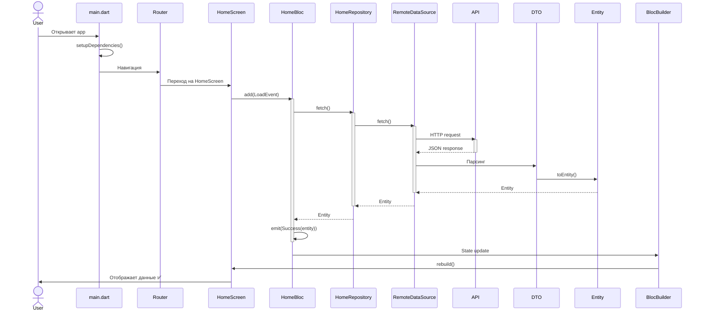

# 🗺️ Карта архитектуры Flutter Project

Визуальное представление архитектуры единого репозитория (single package).

## 📦 Структура проекта

```
flutter_project/
├── � pubspec.yaml                  # Единый pubspec для всего проекта
├── 📱 android/                      # Android платформа
├── 📱 ios/                          # iOS платформа
├── 📁 assets/                       # Ассеты (изображения, шрифты)
├── 📁 lib/
│   ├── 📄 main.dart                # Точка входа приложения
│   └── 📁 src/
│       │
│       ├── 📁 app/                 # Глобальный слой приложения
│       │   ├── bloc/               # AppBlocObserver, AppBloc
│       │   ├── logic/              # Startup, композиция зависимостей
│       │   ├── model/              # Глобальные модели (DependenciesContainer)
│       │   ├── navigation/         # Роутинг, AppRouter
│       │   └── widget/             # Глобальные виджеты (MaterialContext, DependenciesScope)
│       │
│       ├── 🔧 core/                # Переиспользуемые модули
│       │   ├── analytics/          # Firebase Analytics
│       │   ├── common/             # Общие утилиты, extensions
│       │   ├── database/           # Drift БД
│       │   ├── error_reporter/     # Sentry error reporting
│       │   ├── logger/             # Логирование
│       │   ├── navigator_api/      # Интерфейсы навигации
│       │   ├── rest_client/        # HTTP клиент
│       │   └── ui_library/         # Переиспользуемые UI компоненты
│       │
│       └── 🎯 feature/             # Feature модули
│           ├── auth/               # Авторизация
│           ├── home/               # Главный экран
│           ├── settings/           # Настройки
│           └── user_profile/       # Профиль пользователя
│
└── 📁 test/                        # Тесты
    ├── src/
    │   ├── core/
    │   └── feature/
    └── widget_test.dart
```

## 🔑 Ключевые отличия от монорепозитория

### Было (монорепозиторий):

- ❌ Каждый модуль = отдельный package с `pubspec.yaml`
- ❌ Зависимости через `path: ../../core/module`
- ❌ Сложная структура с множеством pubspec.yaml

### Стало (единый репозиторий):

- ✅ **Один** `pubspec.yaml` в корне проекта
- ✅ Все модули - это просто папки внутри `lib/src/`
- ✅ Импорты через package: `import 'package:template_flutter_claude/src/core/logger/logger.dart'`
- ✅ Простая структура, легче поддерживать

```

## 🏗️ Clean Architecture (Feature модуль)

```

lib/src/feature/user_profile/
├── 🎨 presentation/ # UI слой
│ ├── bloc/
│ │ └── user_profile_bloc.dart
│ │ ├── UserProfileBloc # BLoC
│ │ ├── UserProfileEvent # sealed class
│ │ │ ├── \_FetchEvent
│ │ │ ├── \_UpdateEvent
│ │ │ └── \_DeleteEvent
│ │ └── UserProfileState # sealed class
│ │ ├── State$Idle
│   │           ├── State$Processing
│ │ ├── State$Success
│   │           └── State$Error
│ └── widget/
│ ├── user_profile_screen.dart # Экран с BlocProvider
│ └── components/ # UI компоненты
│
├── 🧠 domain/ # Бизнес-логика
│ ├── models/
│ │ └── user_profile_entity.dart # Entity (доменная модель)
│ └── repositories/
│ └── user_profile_repository.dart # Interface (контракт)
│
├── 💾 data/ # Источники данных
│ ├── models/
│ │ └── user_profile_dto.dart # DTO (для API/БД)
│ ├── datasources/
│ │ ├── user_profile_remote_ds.dart # API
│ │ └── user_profile_local_ds.dart # БД
│ └── repositories/
│ └── user_profile_repository_impl.dart # Реализация
│
└── 🔌 dependencies/ # Dependency Injection
└── user_profile_dependencies.dart

````

### Импорты в проекте

**Используем полные package импорты:**

```dart
// ✅ ПРАВИЛЬНО - полные package импорты
import 'package:template_flutter_claude/src/core/logger/app_logger.dart';
import 'package:template_flutter_claude/src/core/rest_client/rest_client.dart';
import 'package:template_flutter_claude/src/feature/auth/presentation/bloc/auth_bloc.dart';

// ❌ НЕПРАВИЛЬНО - относительные импорты (не используем!)
import '../../../core/logger/app_logger.dart';
```

**Преимущества полных импортов:**
- ✅ Явная структура зависимостей
- ✅ Легче рефакторинг (IDE автоматически обновляет)
- ✅ Не нужно считать уровни `../../../`
- ✅ Единообразие во всем проекте


## 🔄 Поток данных

```mermaid
graph TB
    subgraph PRESENTATION
        Widget[Widget<br/>UI Layer]
        BLoC[BLoC<br/>Logic]
        State[State<br/>Reactive]

        Widget -->|add Event| BLoC
        BLoC -->|emit State| State
        State -->|rebuild| Widget
    end

    subgraph DOMAIN
        RepoInterface[Repository Interface<br/>Contract]
    end

    subgraph DATA
        RepoImpl[Repository Impl<br/>Implementation]
        RemoteDS[Remote DataSource<br/>API/Dio]
        LocalDS[Local DataSource<br/>Drift/SQLite]
        RemoteDTO[DTO]
        LocalDTO[DTO]
        Entity[Entity<br/>Domain Model]

        RepoImpl --> RemoteDS
        RepoImpl --> LocalDS
        RemoteDS --> RemoteDTO
        LocalDS --> LocalDTO
        RemoteDTO -->|toEntity| Entity
        LocalDTO -->|toEntity| Entity
    end

    BLoC -->|call method| RepoInterface
    RepoInterface -.implements.-> RepoImpl
    Entity -->|return| RepoImpl
    RepoImpl -->|return| BLoC

    style PRESENTATION fill:#e3f2fd
    style DOMAIN fill:#fff3e0
    style DATA fill:#f3e5f5
````

## 🎭 BLoC Pattern с миксинами

```mermaid
classDiagram
    class UserProfileBloc {
        +extends Bloc~Event, State~
        +with SetStateMixin
        +with BlocController
        +on~FetchEvent~()
        +on~UpdateEvent~()
        +on~DeleteEvent~()
        -_onFetch(event, emit)
        -_onUpdate(event, emit)
        -_onDelete(event, emit)
    }

    class SetStateMixin {
        <<mixin>>
        +setState(State state)
        +Упрощает emit
    }

    class BlocController {
        <<mixin>>
        +handle(processing, error)
        +onError(error, stackTrace)
        +Централизованная обработка
    }

    class EventHandler {
        <<pattern>>
        on~Event~((event, emit) => switch)
        FetchEvent => _onFetch()
        UpdateEvent => _onUpdate()
        DeleteEvent => _onDelete()
    }

    class HandleMethod {
        <<pattern>>
        processing: async callback
        setState(Processing)
        repository.fetch()
        setState(Success)
        ---
        error: async callback
        setState(Error)
    }

    UserProfileBloc ..|> SetStateMixin : uses
    UserProfileBloc ..|> BlocController : uses
    UserProfileBloc --> EventHandler : implements
    EventHandler --> HandleMethod : calls
```

##

## 🗂️ Файловая структура (пример)

```
lib/src/feature/user_profile/
├── 📁 presentation/
│   ├── 📁 bloc/
│   │   └── 📄 user_profile_bloc.dart                  # 300 lines
│   └── 📁 widget/
│       ├── 📄 user_profile_screen.dart                # 50 lines
│       └── 📁 components/
│           ├── 📄 profile_header.dart                 # 80 lines
│           ├── 📄 profile_info.dart                   # 100 lines
│           └── 📄 profile_actions.dart                # 60 lines
├── 📁 domain/
│   ├── 📁 models/
│   │   └── 📄 user_profile_entity.dart                # 100 lines
│   └── 📁 repositories/
│       └── 📄 user_profile_repository.dart            # 30 lines (interface)
├── 📁 data/
│   ├── 📁 models/
│   │   └── 📄 user_profile_dto.dart                   # 80 lines
│   ├── 📁 datasources/
│   │   ├── 📄 user_profile_remote_ds.dart             # 100 lines
│   │   └── 📄 user_profile_local_ds.dart              # 80 lines
│   └── 📁 repositories/
│       └── 📄 user_profile_repository_impl.dart       # 120 lines
└── 📁 dependencies/
    └── 📄 user_profile_dependencies.dart              # 50 lines

# Тесты в отдельной папке
test/src/feature/user_profile/
├── 📁 bloc/
│   └── 📄 user_profile_bloc_test.dart                 # 200 lines
├── 📁 repositories/
│   └── 📄 user_profile_repository_test.dart           # 150 lines
└── 📁 datasources/
    └── 📄 user_profile_remote_ds_test.dart            # 100 lines
```

## 📄 Единый pubspec.yaml

## 🎨 UI Component Hierarchy

```
lib/src/core/ui_library/
├── components/
│   ├── buttons/
│   │   ├── app_button.dart             # Primary, Secondary, Outlined
│   │   └── app_icon_button.dart
│   ├── inputs/
│   │   ├── app_text_field.dart
│   │   ├── app_dropdown.dart
│   │   └── app_checkbox.dart
│   ├── cards/
│   │   ├── app_card.dart
│   │   └── app_info_card.dart
│   ├── dialogs/
│   │   ├── app_dialog.dart
│   │   ├── confirmation_dialog.dart
│   │   └── loading_dialog.dart
│   └── loaders/
│       ├── app_loader.dart
│       └── app_progress_bar.dart
├── theme/
│   ├── app_theme.dart
│   ├── app_colors.dart
│   ├── app_text_styles.dart
│   └── app_dimensions.dart
└── extensions/
    ├── context_extensions.dart
    ├── string_extensions.dart
    └── datetime_extensions.dart
```

## 📊 Типичный User Flow


