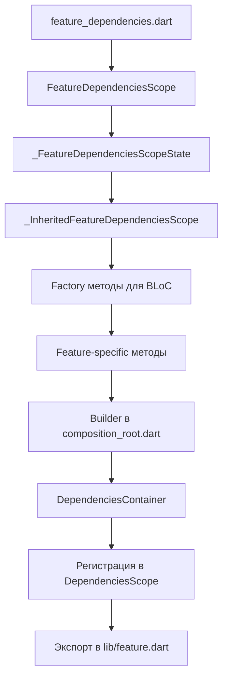
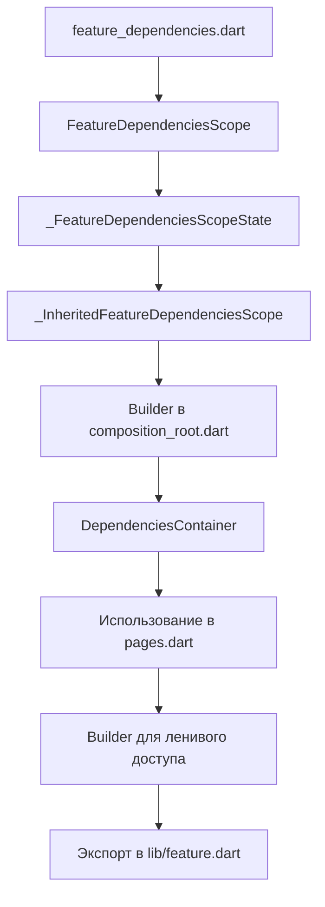

# Dependency Injection в проекте

## 🎯 Цель документа

Объяснить систему Dependency Injection (DI) в проекте:

- Двухуровневая архитектура DI (Application-Wide + Feature-Scoped)
- Паттерн Dependencies + Scope + InheritedWidget
- Lifecycle управление зависимостями
- Когда использовать Application-Wide vs Screen-Scoped

---

## 📐 Архитектура DI

### Ключевые концепции

Проект использует **двухуровневую систему DI**:

1. **Level 1: Application-Wide Dependencies** (глобальный)

   - Создаются один раз при старте приложения
   - Живут весь lifecycle приложения

2. **Level 2: Feature-Scoped Dependencies** (фича-специфичный)
   - Создаются для конкретной фичи
   - Нужны только когда открыть экран какой то фичи, а если мы уходим с экрана то и скоуп с зависимостями тоже удаляется
   - Могут жить весь lifecycle приложения ИЛИ только во время показа экрана

### Используемые паттерны

✅ **Composition Root** - единая точка создания зависимостей  
✅ **InheritedWidget** - прокидывание зависимостей по дереву  
✅ **Factory Pattern** - создание новых инстансов BLoC  
✅ **Stateful Scope** - управление lifecycle зависимостей

---

## 📦 Level 1: Application-Wide Dependencies

### Структура

```dart
// app/lib/src/model/dependencies_container.dart
class DependenciesContainer {
  const DependenciesContainer({
    required this.logger,
    required this.config,
    required this.database,
    required this.errorReporter,
    required this.packageInfo,
    required this.settingsContainer,

    // Feature Dependencies (Level 2)
    required this.authDependencies,
    required this.ttsDependencies,
    required this.userProfileDependencies,
    required this.historyEntriesDependencies,
    required this.homeDependencies,
    required this.instructionDependencies,
  });

  // Core dependencies
  final Logger logger;
  final ApplicationConfig config;
  final AppDatabase database;
  final ErrorReporter errorReporter;
  final PackageInfo packageInfo;
  final SettingsContainer settingsContainer;

  // Feature-specific dependencies
  final AuthDependencies authDependencies;
  final TtsDependencies ttsDependencies;
  final UserProfileDependencies userProfileDependencies;
  final HistoryEntriesDependencies historyEntriesDependencies;
  final HomeDependencies homeDependencies;
  final InstructionDependencies instructionDependencies;
}
```

### Создание в Composition Root

```dart
// app/lib/src/logic/composition_root.dart
Future<DependenciesContainer> createDependenciesContainer(
  ApplicationConfig config,
  Logger logger,
  ErrorReporter errorReporter,
) async {
  // 1. Core dependencies (глобальные сервисы)
  final sharedPreferences = SharedPreferencesAsync();
  final client = createDefaultHttpClient();
  final database = AppDatabase.defaults(name: 'healt_app');
  final packageInfo = await PackageInfo.fromPlatform();
  final settingsContainer = await SettingsContainer.create(sharedPreferences);

  // 2. REST Client
  final RestClientBase restClient = RestClientHttp(
    baseUrl: config.baseUrl,
    client: interceptedClient,
  );

  // 3. Repositories
  final authRepository = AuthRepositoryImpl(
    authDataSource: authDataSource,
    storage: storage,
    userSessionStorage: userSessionStorage,
  );

  final historyRepository = HistoryRepositoryImpl(
    database: userScopedDatabase,
    restClient: restClient,
  );

  // 4. Global BLoCs
  final authBloc = AuthBloc(
    authRepository: authRepository,
    homeNavigator: homeNavigator,
  );

  final workoutStreakBloc = WorkoutStreakBloc(
    historyRepository: historyRepository,
  );

  // 5. Feature Dependencies
  final authDependencies = buildAuthDependencies(
    authBloc: authBloc,
    homeNavigator: homeNavigator,
    authNavigator: authNavigator,
    authRepository: authRepository,
  );

  final historyEntriesDependencies = buildHistoryEntriesDependencies(
    homeNavigator: homeNavigator,
    historyRepository: historyRepository,
    workoutStreakBloc: workoutStreakBloc,
    database: userScopedDatabase,
    historyNavigator: historyNavigator,
    workoutNavigator: workoutNavigator,
  );

  // 6. Compose all
  return DependenciesContainer(
    logger: logger,
    config: config,
    database: database,
    errorReporter: errorReporter,
    packageInfo: packageInfo,
    settingsContainer: settingsContainer,
    authDependencies: authDependencies,
    ttsDependencies: ttsDependencies,
    userProfileDependencies: userProfileDependencies,
    historyEntriesDependencies: historyEntriesDependencies,
    homeDependencies: homeDependencies,
    instructionDependencies: instructionDependencies,
  );
}
```

### Регистрация через DependenciesScope

```dart
// app/lib/src/widget/dependencies_scope.dart
class DependenciesScope extends StatelessWidget {
  const DependenciesScope({
    required this.dependencies,
    required this.child,
    super.key,
  });

  final DependenciesContainer dependencies;
  final Widget child;

  /// Получить dependencies из context
  static DependenciesContainer of(BuildContext context) =>
      context.inhOf<_DependenciesInherited>(listen: false).dependencies;

  @override
  Widget build(BuildContext context) {
    return _DependenciesInherited(
      dependencies: dependencies,
      child: AuthDependenciesInherited(
        dependencies: dependencies.authDependencies,
        child: UserProfileDependenciesInherited(
          dependencies: dependencies.userProfileDependencies,
          child: HistoryEntriesDependenciesScope(
            dependencies: dependencies.historyEntriesDependencies,
            child: InstructionScope(
              dependencies: dependencies.instructionDependencies,
              child: SettingsScope(
                settingsContainer: dependencies.settingsContainer,
                child: child,
              ),
            ),
          ),
        ),
      ),
    );
  }
}
```

**Важно**: `DependenciesScope` оборачивает корень приложения в `main.dart`

---

## 📦 Level 2: Feature-Scoped Dependencies

### Паттерн: Dependencies + Scope + InheritedWidget

Каждая фича состоит из 4 компонентов:

#### 1. Dependencies Container (пассивный контейнер)

```dart
// feature/history_entries/lib/src/dependencies/history_entries_dependencies.dart
class HistoryEntriesDependencies {
  const HistoryEntriesDependencies({
    required this.database,
    required this.historyRepository,
    required this.workoutStreakBloc,
    required this.historyNavigator,
    required this.workoutNavigator,
    required this.homeNavigator,
  });

  final HistoryEntriesDataSource database;
  final HistoryRepository historyRepository;
  final WorkoutStreakBloc workoutStreakBloc;
  final HistoryNavigator historyNavigator;
  final WorkoutNavigator workoutNavigator;
  final HomeNavigator homeNavigator;

  /// Получить dependencies из context
  static HistoryEntriesDependencies of(BuildContext context) {
    final inherited = context
        .getInheritedWidgetOfExactType<_InheritedHistoryEntriesDependenciesScope>();
    assert(inherited != null, 'No HistoryEntriesDependencies found in context');
    return inherited!.state.dependencies;
  }
}
```

**Содержит**:

- ✅ Репозитории фичи
- ✅ Навигаторы
- ✅ Глобальные BLoC (если нужны)
- ✅ DataSources

**НЕ содержит**:

- ❌ UI контроллеры

#### 2. Dependencies Scope (StatefulWidget)

```dart
class HistoryEntriesDependenciesScope extends StatefulWidget {
  const HistoryEntriesDependenciesScope({
    required this.child,
    required this.dependencies,
    super.key,
  });

  final Widget child;
  final HistoryEntriesDependencies dependencies;

  /// Получить Scope State
  static _HistoryEntriesDependenciesScopeState of(
    BuildContext context, {
    bool listen = true,
  }) => _InheritedHistoryEntriesDependenciesScope.of(context, listen: listen).state;

  @override
  State<HistoryEntriesDependenciesScope> createState() =>
      _HistoryEntriesDependenciesScopeState();
}
```

#### 3. Scope State (управление lifecycle)

```dart
class _HistoryEntriesDependenciesScopeState
    extends State<HistoryEntriesDependenciesScope> {

  // Feature-specific BLoCs (создаются здесь)
  late final HistoryEntriesBloc _historyEntriesBloc;
  late final HistoryEntryBloc _historyEntryBlocForDayCounter;
  late final LastPhotoSetBloc _lastPhotoSetBloc;

  @override
  void initState() {
    super.initState();

    // Создаём BLoC при инициализации Scope
    _historyEntriesBloc = HistoryEntriesBloc(
      historyRepository: dependencies.historyRepository,
    );

    _historyEntryBlocForDayCounter = HistoryEntryBloc(
      historyRepository: dependencies.historyRepository,
    );

    _lastPhotoSetBloc = LastPhotoSetBloc(
      historyRepository: dependencies.historyRepository,
    );
  }

  @override
  void dispose() {
    super.dispose();

    // Очищаем BLoC при dispose Scope
    _historyEntriesBloc.close();
    _historyEntryBlocForDayCounter.close();
    _lastPhotoSetBloc.close();
  }

  @override
  Widget build(BuildContext context) {
    return BlocListener<HistoryEntryBloc, HistoryEntryState>(
      bloc: _historyEntryBlocForDayCounter,
      listener: (context, state) {
        // Feature-specific логика
        if (state is HistoryEntryState$Success) {
          final entry = state.data;
          if (entry != null && _isToday(entry.date) && entry.workoutsCount > 0) {
            dependencies.workoutStreakBloc.add(
              const WorkoutStreakEvent.loadCurrentStreak(),
            );
            _historyEntriesBloc.add(
              const HistoryEntriesEvent.loadHistoryEntries(),
            );
            _lastPhotoSetBloc.add(
              const LastPhotoSetEvent.fetch(),
            );
          }
        }
      },
      child: _InheritedHistoryEntriesDependenciesScope(
        state: this,
        child: widget.child,
      ),
    );
  }

  // Геттеры для доступа к зависимостям
  HistoryEntriesDependencies get dependencies => widget.dependencies;
  HistoryEntriesBloc get historyEntriesBloc => _historyEntriesBloc;
  HistoryEntryBloc get historyEntryBlocForDayCounter => _historyEntryBlocForDayCounter;
  LastPhotoSetBloc get lastPhotoSetBloc => _lastPhotoSetBloc;

  // Factory методы для создания новых BLoC
  HistoryEntriesBloc createHistoryEntriesBloc() => HistoryEntriesBloc(
    historyRepository: dependencies.historyRepository,
  );

  HistoryEntryBloc createHistoryEntryBloc() => HistoryEntryBloc(
    historyRepository: dependencies.historyRepository,
  );

  // Feature-specific методы
  void fetchBlocksData() {
    _historyEntriesBloc.add(const HistoryEntriesEvent.loadHistoryEntries());
    _historyEntryBlocForDayCounter.add(const HistoryEntryEvent.loadTodayEntries());
    _lastPhotoSetBloc.add(const LastPhotoSetEvent.fetch());
    widget.dependencies.workoutStreakBloc.add(
      const WorkoutStreakEvent.initializeStreaks(),
    );
  }

  void clearHistoryData() {
    _historyEntriesBloc.add(const HistoryEntriesEvent.clearHistoryData());
    _historyEntryBlocForDayCounter.add(const HistoryEntryEvent.clearHistoryEntryData());
    widget.dependencies.workoutStreakBloc.add(const WorkoutStreakEvent.clearStreak());
  }

  bool _isToday(DateTime date) {
    final now = DateTime.now();
    final today = DateTime(now.year, now.month, now.day);
    final entryDate = DateTime(date.year, date.month, date.day);
    return today == entryDate;
  }
}
```

#### 4. InheritedWidget (прокидывание по дереву)

```dart
class _InheritedHistoryEntriesDependenciesScope extends InheritedWidget {
  const _InheritedHistoryEntriesDependenciesScope({
    required this.state,
    required super.child,
  });

  final _HistoryEntriesDependenciesScopeState state;

  static _InheritedHistoryEntriesDependenciesScope? maybeOf(
    BuildContext context, {
    bool listen = true,
  }) => listen
      ? context.dependOnInheritedWidgetOfExactType<_InheritedHistoryEntriesDependenciesScope>()
      : context
            .getElementForInheritedWidgetOfExactType<_InheritedHistoryEntriesDependenciesScope>()
            ?.widget as _InheritedHistoryEntriesDependenciesScope?;

  static _InheritedHistoryEntriesDependenciesScope of(
    BuildContext context,
    {bool listen = true}
  ) => maybeOf(context, listen: listen) ??
      throw ArgumentError('No _InheritedHistoryEntriesDependenciesScope found in context');

  @override
  bool updateShouldNotify(covariant _InheritedHistoryEntriesDependenciesScope oldWidget) => false;
}
```

---

## 🔄 Два типа Scope: Application-Wide vs Screen-Scoped

### Type 1: Application-Wide Scope

**Когда использовать:**

- Фича используется на нескольких экранах
- BLoC должны жить весь lifecycle приложения
- Нужен доступ к данным из любой точки приложения

**Примеры:** `HistoryEntriesDependenciesScope`, `UserProfileDependenciesScope`

**Регистрация:**

```dart
// В DependenciesScope (корень приложения)
class DependenciesScope extends StatelessWidget {
  @override
  Widget build(BuildContext context) {
    return _DependenciesInherited(
      dependencies: dependencies,
      child: HistoryEntriesDependenciesScope(  // ✅ Application-Wide
        dependencies: dependencies.historyEntriesDependencies,
        child: UserProfileDependenciesInherited(
          dependencies: dependencies.userProfileDependencies,
          child: child,
        ),
      ),
    );
  }
}
```

**Характеристики:**

- ✅ Создаётся при старте приложения
- ✅ BLoC живут весь lifecycle приложения
- ✅ Не dispose при навигации
- ✅ Доступны из любого экрана через `context`

---

### Type 2: Screen-Scoped

**Когда использовать:**

- Фича привязана к конкретному экрану
- BLoC нужны только пока экран активен
- Данные не нужны после ухода с экрана

**Примеры:** `TtsDependenciesScope`, `OnboardingScope`

**Регистрация:**

```dart
// В pages.dart (создаётся при навигации)
enum AppPages {
  workout('workout', title: 'Workout');

  Widget builder(BuildContext context, Map<String, String>? arguments) {
    switch (this) {
      case AppPages.workout:
        return TtsDependenciesScope(  // ✅ Screen-Scoped
          dependencies: DependenciesScope.of(context).ttsDependencies,
          child: Builder(
            builder: (context) {
              final isDontShowAgain = TtsDependenciesScope.of(context)
                  .state.controllerInstruction.isDontShowAgain;

              return WorkoutNestedNavigator(
                initialPage: isDontShowAgain
                    ? WorkoutPages.workout
                    : WorkoutPages.instruction,
              );
            },
          ),
        );
    }
  }
}
```

**Характеристики:**

- ✅ Создаётся при переходе на экран
- ✅ Dispose при уходе с экрана (навигация назад)
- ✅ BLoC/Controllers живут только пока экран активен
- ✅ Экономит ресурсы (не держит в памяти неиспользуемые BLoC)

---

## 📐 Архитектурные паттерны

### 1. Composition Root Pattern

**Правило:** Все зависимости создаются в одном месте - `composition_root.dart`

**Обоснование:**

- Единая точка создания облегчает понимание dependency graph
- Легко найти, где и как создаётся зависимость
- Удобно тестировать (можно заменить реализации)

**Пример:**

```dart
// ❌ ПЛОХО - создание зависимостей в UI
class HomeScreen extends StatelessWidget {
  @override
  Widget build(BuildContext context) {
    final repository = HomeRepositoryImpl(
      restClient: RestClientHttp(...),  // ❌ Создаём здесь
    );
    return HomeContent(repository: repository);
  }
}

// ✅ ХОРОШО - получение из Composition Root
class HomeScreen extends StatelessWidget {
  @override
  Widget build(BuildContext context) {
    final dependencies = HomeDependencies.of(context);  // ✅ Получаем из DI
    return HomeContent(repository: dependencies.repository);
  }
}
```

---

### 2. Factory Pattern для BLoC

**Правило:** Создавай factory методы в Scope State для новых инстансов BLoC

**Обоснование:**

- Позволяет создавать новые BLoC с теми же зависимостями
- Удобно для экранов, где нужен локальный BLoC
- Избегаем дублирования кода создания

**Пример:**

```dart
// В Scope State
class _HistoryEntriesDependenciesScopeState extends State<...> {
  // Factory для создания новых BLoC
  HistoryEntryBloc createHistoryEntryBloc() => HistoryEntryBloc(
    historyRepository: dependencies.historyRepository,
  );
}

// Использование в UI
class HistoryEntryDetailScreen extends StatelessWidget {
  @override
  Widget build(BuildContext context) {
    return BlocProvider(
      create: (context) => HistoryEntriesDependenciesScope.of(context)
          .state
          .createHistoryEntryBloc()  // ✅ Создаём через factory
          ..add(HistoryEntryEvent.load(id: entryId)),
      child: HistoryEntryContent(),
    );
  }
}
```

---

### 3. InheritedWidget для доступа

**Правило:** Используй InheritedWidget для получения зависимостей из context

**Обоснование:**

- Стандартный Flutter паттерн
- Автоматическая перестройка при изменениях (если `listen: true`)
- Чистый API для доступа к зависимостям

**Пример:**

```dart
// Получение dependencies
final dependencies = HistoryEntriesDependencies.of(context);

// Получение Scope State
final scopeState = HistoryEntriesDependenciesScope.of(context);

// Получение конкретного BLoC
final bloc = scopeState.state.historyEntriesBloc;

// Вызов feature-specific метода
scopeState.state.fetchBlocksData();
```

---

## ✅ Best Practices

### 1. Разделение ответственности

**Dependencies Container (пассивный):**

```dart
// ✅ ХОРОШО - только данные
class HistoryEntriesDependencies {
  final HistoryRepository historyRepository;
  final HistoryNavigator historyNavigator;
  final WorkoutStreakBloc workoutStreakBloc;
}

// ❌ ПЛОХО - создание BLoC в контейнере
class HistoryEntriesDependencies {
  late final HistoryEntriesBloc bloc;  // ❌ Нет lifecycle управления
}
```

**Scope State (активный):**

```dart
// ✅ ХОРОШО - управление lifecycle
class _HistoryEntriesDependenciesScopeState {
  late final HistoryEntriesBloc _bloc;

  @override
  void initState() {
    _bloc = HistoryEntriesBloc(...);  // ✅ Создание
  }

  @override
  void dispose() {
    _bloc.close();  // ✅ Очистка
  }
}
```

---

### 2. Builder Pattern для ленивой инициализации

**Правило:** Используй `Builder` для отложенного доступа к Scope

**Обоснование:**

- Scope создаётся до того, как можно получить его через `of(context)`
- Builder позволяет получить Scope после его полной инициализации

**Пример:**

```dart
// ✅ ХОРОШО - Builder для отложенного доступа
case AppPages.workout:
  return TtsDependenciesScope(
    dependencies: DependenciesScope.of(context).ttsDependencies,
    child: Builder(  // ✅ Ленивый доступ к Scope
      builder: (context) {
        final isDontShowAgain = TtsDependenciesScope.of(context)
            .state.controllerInstruction.isDontShowAgain;
        return WorkoutNestedNavigator(...);
      },
    ),
  );

// ❌ ПЛОХО - прямой доступ без Builder
case AppPages.workout:
  final isDontShowAgain = TtsDependenciesScope.of(context)  // ❌ Ошибка!
      .state.controllerInstruction.isDontShowAgain;
  return TtsDependenciesScope(...);
```

---

### 3. Геттеры для чистого API

**Правило:** Создавай геттеры в Scope State для удобного доступа

**Пример:**

```dart
class _HistoryEntriesDependenciesScopeState {
  late final HistoryEntriesBloc _historyEntriesBloc;

  // ✅ Геттер для чистого API
  HistoryEntriesBloc get historyEntriesBloc => _historyEntriesBloc;
  HistoryEntriesDependencies get dependencies => widget.dependencies;
}

// Использование
final bloc = HistoryEntriesDependenciesScope.of(context)
    .state
    .historyEntriesBloc;  // ✅ Чистый доступ
```

---

### 4. Feature-specific методы в Scope State

**Правило:** Добавляй методы для общих операций фичи

**Пример:**

```dart
class _HistoryEntriesDependenciesScopeState {
  // ✅ Feature-specific метод
  void fetchBlocksData() {
    _historyEntriesBloc.add(const HistoryEntriesEvent.loadHistoryEntries());
    _historyEntryBlocForDayCounter.add(const HistoryEntryEvent.loadTodayEntries());
    _lastPhotoSetBloc.add(const LastPhotoSetEvent.fetch());
    widget.dependencies.workoutStreakBloc.add(
      const WorkoutStreakEvent.initializeStreaks(),
    );
  }

  void clearHistoryData() {
    _historyEntriesBloc.add(const HistoryEntriesEvent.clearHistoryData());
    _historyEntryBlocForDayCounter.add(const HistoryEntryEvent.clearHistoryEntryData());
    widget.dependencies.workoutStreakBloc.add(const WorkoutStreakEvent.clearStreak());
  }
}

// Использование
HistoryEntriesDependenciesScope.of(context).state.fetchBlocksData();
```

---

## 📋 Чеклист создания фичи с DI

### Для Application-Wide фичи



**Шаги:**

- [ ] Создай `{feature}_dependencies.dart` с контейнером зависимостей
- [ ] Создай `{Feature}DependenciesScope` (StatefulWidget)
- [ ] Создай `_{Feature}DependenciesScopeState` с lifecycle управлением
- [ ] Создай `_Inherited{Feature}DependenciesScope` (InheritedWidget)
- [ ] Добавь factory методы для создания BLoC
- [ ] Добавь feature-specific методы в State
- [ ] Создай builder функцию в `composition_root.dart`
- [ ] Добавь dependencies в `DependenciesContainer`
- [ ] Зарегистрируй Scope в `DependenciesScope` (корень приложения)
- [ ] Экспортируй публичное API в `lib/{feature}.dart`

### Для Screen-Scoped фичи



**Шаги:**

- [ ] Создай `{feature}_dependencies.dart` с контейнером зависимостей
- [ ] Создай `{Feature}DependenciesScope` (StatefulWidget)
- [ ] Создай `_{Feature}DependenciesScopeState` с lifecycle управлением
- [ ] Создай `_Inherited{Feature}DependenciesScope` (InheritedWidget)
- [ ] Создай builder функцию в `composition_root.dart`
- [ ] Добавь dependencies в `DependenciesContainer`
- [ ] Используй Scope в `pages.dart` при навигации на экран
- [ ] Оберни child в `Builder` для ленивого доступа
- [ ] Экспортируй публичное API в `lib/{feature}.dart`

---

## 🔗 См. также

- [BLoC Pattern](./bloc-pattern.md) - паттерн управления состоянием
- [Feature модули](../modules/feature-modules.md) - создание фич
- [Core модули](../modules/core-modules.md) - создание Core модулей
